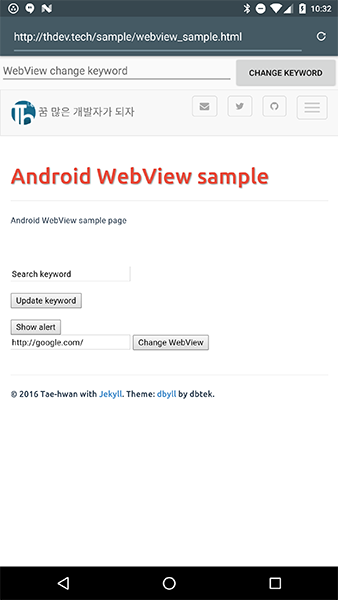

# Summary

[]()

Android WebView JavascriptInterface 예제입니다

일부 Kotlin 코드로 작성되어 있으며, base 코드는 Kotlin을 사용하였습니다.

Android Test 코드 역시 Kotlin과 Java로 작성되어 있습니다.


## Android Developer Version info

- buildToolsVersion = 24.0.1
- compile sdk version = 24
- Target sdk version = 24
- Min sdk version = 16
- Android studio 2.2+


## Use Library version

- Kotlin version : 1.0.3

- support library version : 24.1.1
- constraint layout version : 1.0.0-alpha7

- junit : 4.12
- test runner/rules : 0.5
- espresso : 2.2.2
- dexmaker mockito : 1.4
- uiautomator : 2.1.2
- awaitility : 1.7.0

## Blog

- [Android WebView javascriptInterface 사용하기](http://thdev.tech/androiddev/2016/08/11/Android-WebView-JavascriptInterface-Example.html)
- [Android WebView TestCode 작성하기 기본 테스트 진행하기](http://thdev.tech/androiddev/2016/08/16/Android-WebView-TestCode.html)
- Android WebView TestCode 작성하기 확장(Alert, Script 만들어 테스트)
- Android WebView Kotlin Base 코드 정의 살펴보기
- Android WebView Kotlin TestCode 작성하기

## Sample WebPage

- [Sample html](https://github.com/taehwandev/taehwandev.github.io/blob/master/sample/webview_sample.html)
- [Sample web page](http://thdev.tech/webview_sample.html)


## Preview

- WebView Sample



- Android Test Sample


## License

```
Copyright 2016 Tae-hwan

Licensed under the Apache License, Version 2.0 (the "License");
you may not use this file except in compliance with the License.
You may obtain a copy of the License at

   http://www.apache.org/licenses/LICENSE-2.0

Unless required by applicable law or agreed to in writing, software
distributed under the License is distributed on an "AS IS" BASIS,
WITHOUT WARRANTIES OR CONDITIONS OF ANY KIND, either express or implied.
See the License for the specific language governing permissions and
limitations under the License.
```
