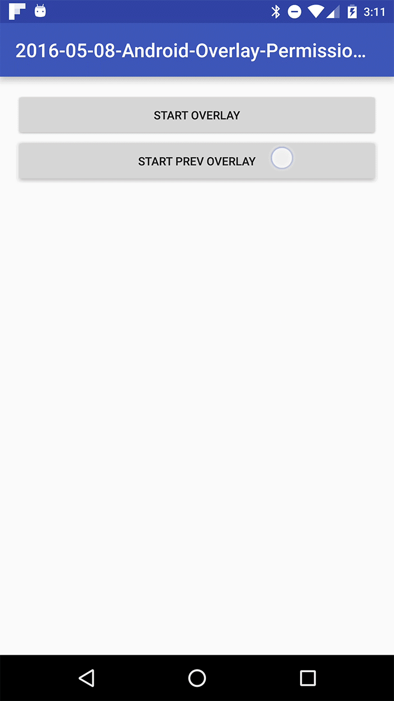

# Summary

[]()

Android 윈도우(Overlay) 권한 획득하기에 사용한 예제 코드입니다

Kotlin과 Java 코드로 분리되어 있습니다.

- [Kotlin Sample](https://github.com/taehwandev/Android-BlogExample/tree/03-Overlay-Permission-Example/app-kotlin)
- [Java sample](https://github.com/taehwandev/Android-BlogExample/tree/03-Overlay-Permission-Example/app)


## Android Developer Version info

- Android studio 2.2.3

## Blog

- [Android 윈도우(Overlay) 권한 획득하기](http://thdev.tech/androiddev/2017/01/30/Android-Overlay-Permission.html)


## Preview

- Android Overlay Sample - SYSTEM_ALERT_WINDOW



## Library version info

- Dependencies
    - [Android support library version](https://developer.android.com/topic/libraries/support-library/revisions.html) : 25.0.1

    - [ButterKnife](http://jakewharton.github.io/butterknife/) : 8.4.0

    - [kotlin](https://kotlinlang.org/docs/tutorials/kotlin-android.html) : 1.0.6
    - [th-base](https://github.com/taehwandev/AndroidBase) : 1.0.4

## API

- Android Marshmallow [SYSTEM_ALERT_WINDOW](https://developer.android.com/reference/android/Manifest.permission.html?hl=ko#SYSTEM_ALERT_WINDOW)


## License

```
Copyright 2016 Tae-hwan

Licensed under the Apache License, Version 2.0 (the "License");
you may not use this file except in compliance with the License.
You may obtain a copy of the License at

   http://www.apache.org/licenses/LICENSE-2.0

Unless required by applicable law or agreed to in writing, software
distributed under the License is distributed on an "AS IS" BASIS,
WITHOUT WARRANTIES OR CONDITIONS OF ANY KIND, either express or implied.
See the License for the specific language governing permissions and
limitations under the License.
```
