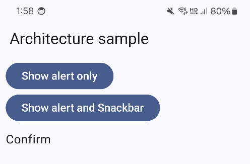
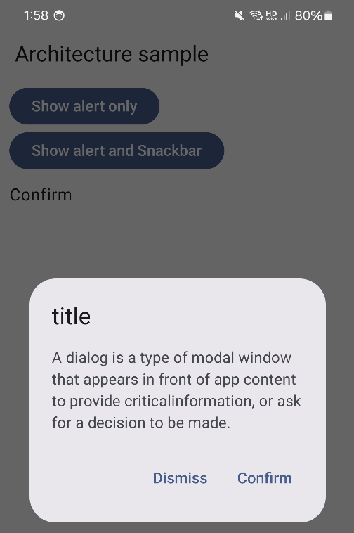
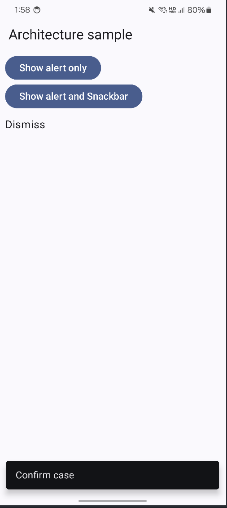

# Summary
Android Architecture

This code implements an architecture that mimics React's state management and reducers within an MVVM architecture. It utilizes uiTrigger for handling alerts and snackbars.

Maybe MVI?

## Preview

### Default



### ShowAlert



### Show Snackbar



## License

```
Copyright 2025 Tae-hwan

Licensed under the Apache License, Version 2.0 (the "License");
you may not use this file except in compliance with the License.
You may obtain a copy of the License at

   http://www.apache.org/licenses/LICENSE-2.0

Unless required by applicable law or agreed to in writing, software
distributed under the License is distributed on an "AS IS" BASIS,
WITHOUT WARRANTIES OR CONDITIONS OF ANY KIND, either express or implied.
See the License for the specific language governing permissions and
limitations under the License.
```
