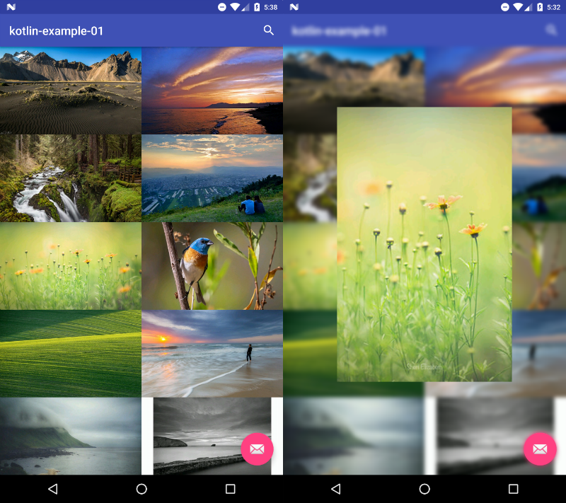

# Summary

[]()

Kotlin을 이용하여 Flickr 예제를 작성합니다.
RecyclerView에 Image를 출력합니다.

build.gradle에 FLICKR_API_KEY를 갱신해주어야 정상 동작합니다
[Create an App - flickr](https://www.flickr.com/services/apps/create/)


## Android Developer Version info

- buildToolsVersion = 24.0.1
- compile sdk version = 24
- Target sdk version = 24
- Min sdk version = 17
- Android studio 2.2 Preview 6


## Use Library version

- Kotlin version = 1.0.3

- support libraryVersion = 24.1.1
- constraint layout version = 1.0.0-alpha4

- Glide version = 3.7.0

- retrofit version = 2.1.0
- okhttp version = 3.3.1

- rxAndroid = 1.2.1
- rxJava = 1.1.6


## Preview




## License

```
Copyright 2016 Tae-hwan

Licensed under the Apache License, Version 2.0 (the "License");
you may not use this file except in compliance with the License.
You may obtain a copy of the License at

   http://www.apache.org/licenses/LICENSE-2.0

Unless required by applicable law or agreed to in writing, software
distributed under the License is distributed on an "AS IS" BASIS,
WITHOUT WARRANTIES OR CONDITIONS OF ANY KIND, either express or implied.
See the License for the specific language governing permissions and
limitations under the License.
```
