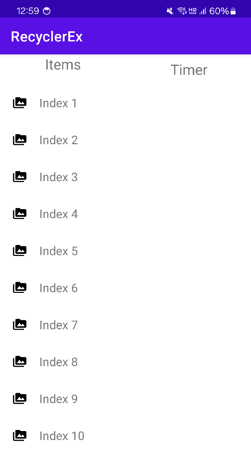
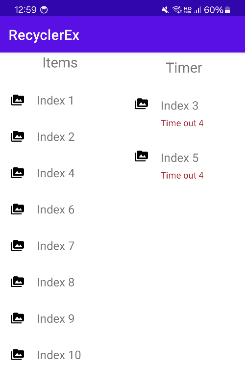

# Summary
RecyclerView timer example

## Preview

2개의 RecyclerView를 활용하고 Coroutines을 활용하여 2개의 목록을 관리

- A 리스트에는 10개의 아이템을 노출
- B 리스트에는 A 목록에서 넘어온 데이터를 기반으로 노출하며 5초 후 A 리스트로 넘어가는 처리

coroutines을 활용하여 각각의 아이템을 처리하는 샘플

- Before
  
- After
  

## License

```
Copyright 2025 Tae-hwan

Licensed under the Apache License, Version 2.0 (the "License");
you may not use this file except in compliance with the License.
You may obtain a copy of the License at

   http://www.apache.org/licenses/LICENSE-2.0

Unless required by applicable law or agreed to in writing, software
distributed under the License is distributed on an "AS IS" BASIS,
WITHOUT WARRANTIES OR CONDITIONS OF ANY KIND, either express or implied.
See the License for the specific language governing permissions and
limitations under the License.
```
